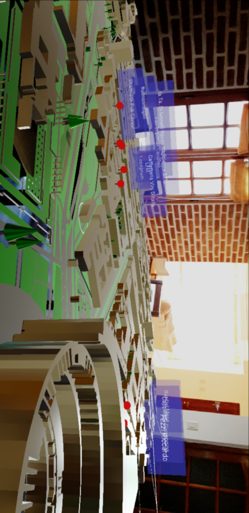
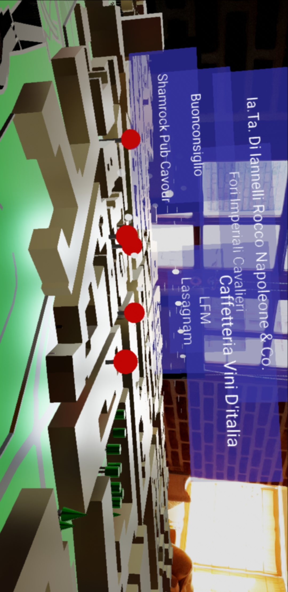
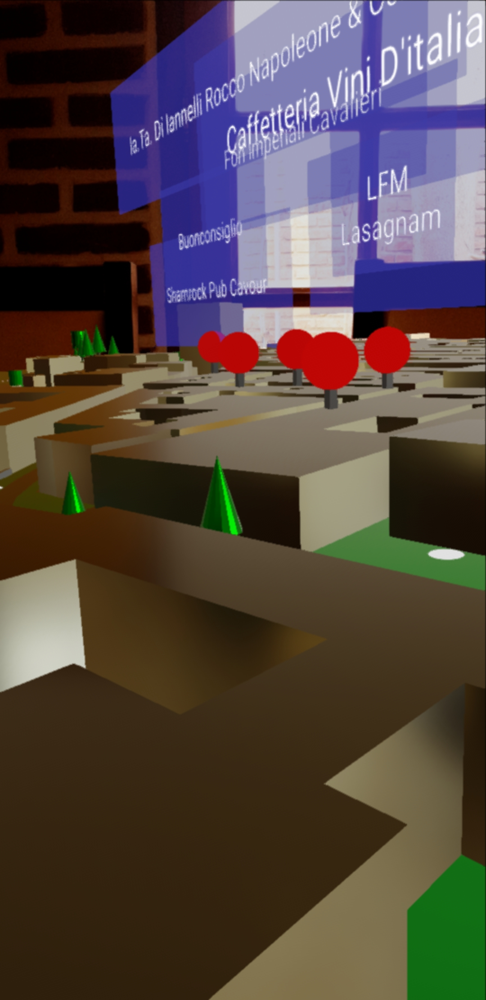
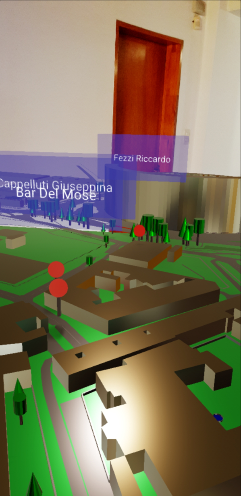
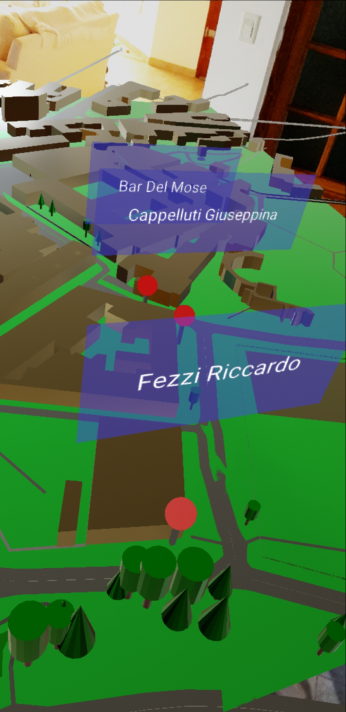
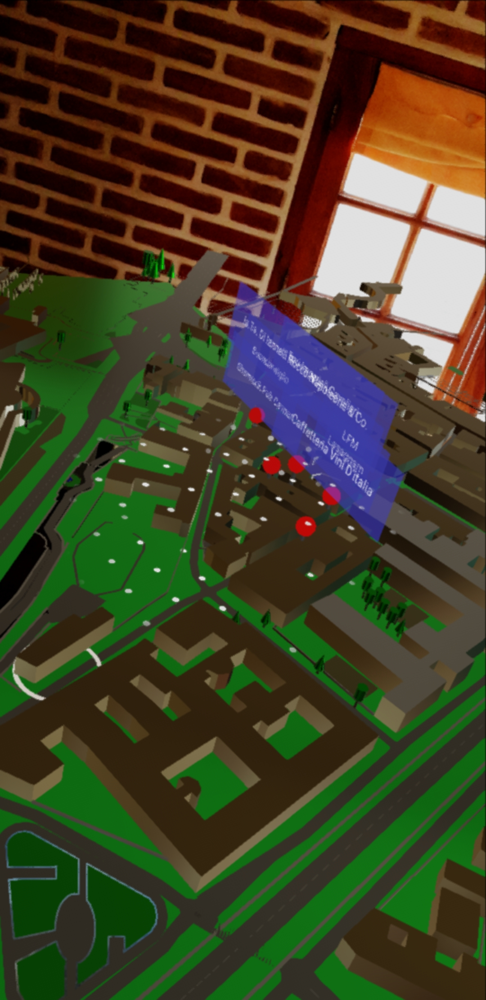

# 3D POIs

Display a real world 3D map model with real world Points of Interest on it, in an Augmented Reality application.

The app displays a portion of Rome with some coffee places around it.

## Prerequisites ##

- [Supported devices](https://developers.google.com/ar/discover/supported-devices)

## Screenshots ##

[Demo](https://youtu.be/qkrsXoZnx-M)

## Screenshots ##

## Main Libraries and Sources ##

- 3D models: [Open Street Maps](https://www.openstreetmap.org/)
- OSM map to OBJ: [OSM2WORLD](http://osm2world.org/)
- [ARCore](https://developers.google.com/ar/discover/)
- [Sceneform](https://developers.google.com/ar/develop/java/sceneform/)
- POIs API: [tomtom](https://developer.tomtom.com/user/me/apps)

## How to add your custom map ##

- Select your map section in Open Street Maps and download it (export). You will get a .osm file.
- Transform the .osm file to .obj via OSM2World.
- Optional step: adjust your .obj model using a tool like Blender (for example, change material colors, remove polygons, etc).
- In Android Studio, import your .obj file using [Google Scenform Tools](https://developers.google.com/ar/develop/java/sceneform/import-assets)
- In `3DPOIsDomain`,  `MapInfoResolver`, you need to set some data about the map. This is needed
to make it possible transform gps coordinates to OpenGl vertex position (in order to place the POIs):
	- Map center. You can find that info in your .osm file, element `bounds`.
	- Scale: Check the generated `.sfa` file. Look for `model -> scale`
	- ReferencePoint: This is a tricky one. Basically, we need a known point in the model to
	associate with a gps coordinate. In the example, we know that one corner of the Coliseum,
	with lat=41.89007, lon=12.49344 is in the vertex `235.84084f, -197.85388f` (altitude not used). 
	This info allow as to performa simple coordinates extrapolation, that it's good enough for a small
	map portion with not much high diferences.
- To use `tomtom` places search, set your key in  `3DPOIsData`, `POIsRepositoryImpl`.